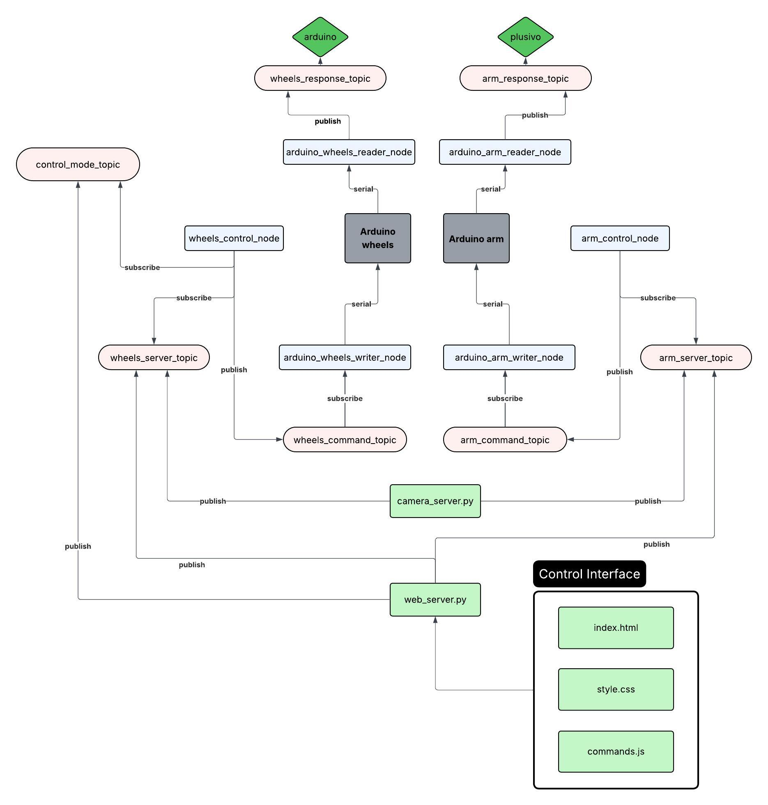

### [< back](technical.md)

# **ROS2**

In the previous year, **ROS 1** was used for **mapping** — generating a map that could later be used to navigate the car to any point on it.

After researching ROS in more detail, we concluded that it could be highly beneficial for our project. Therefore, we decided to adopt it and agreed to use the latest available version. Since the Jetson Orin Nano 8GB supports up to Ubuntu 22.04, we installed **ROS 2 Humble Hawksbil** on it.

**[ROS 2 Humble installation guide](https://docs.ros.org/en/humble/Installation/Ubuntu-Install-Debs.html)**

To take full advantage of the available resources, we also installed ROS 2 on the Jetson Nano 4GB, but in this case, we used an older version — **ROS 2 Foxy Fitzroy** — the latest release compatible with Ubuntu 20.04.

We aimed to use ROS 2 as extensively as possible. As a result, **any component that could be regarded as a ROS 2 node** was implemented as one.

In the image below, you can see all the created nodes and how they **communicate** with each other.

If you decide to **build** upon this pre-existing structure, you are welcome to **[edit it here](https://lucid.app/lucidchart/047bf23a-e6d6-46c2-be1c-202b1bc32ffb/edit?viewport_loc=-1022%2C-331%2C3680%2C1814%2C0_0&invitationId=inv_eb6fe308-f239-4732-a077-c2921b462ca8)**.

